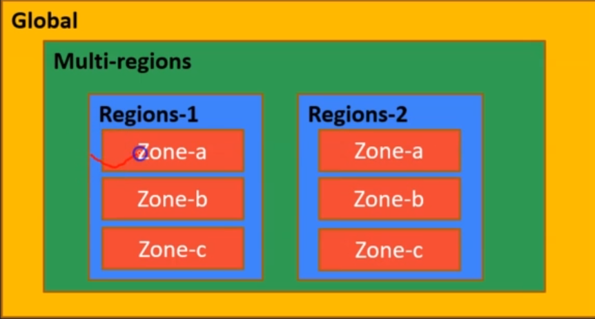

# Google Cloud Professional DevOps Engineer certification

## Introduction

the Google Cloud Professional DevOps Engineer certification is designed for individuals who have experience implementing CI/CD pipelines, automating infrastructure, and managing application deployments on Google Cloud Platform (GCP). This certification demonstrates proficiency in using Google Cloud technologies to build highly scalable and reliable applications.

Here are some key details about the Google Cloud Professional DevOps Engineer certification:

### Exam Details

`Exam Code`: There isn't a specific exam code, but the certification exam covers various topics related to DevOps practices on Google Cloud Platform.

`Duration`: Typically around 2 hours

`Question Format`: Multiple-choice and multiple-select questions, as well as scenario-based questions requiring hands-on experience with Google Cloud Platform.

### Exam Topics
The exam covers a range of topics, including but not limited to:

:one: Designing and implementing CI/CD pipelines on Google Cloud Platform using tools like Cloud Build, Jenkins, and GitHub Actions.

:two: Automating infrastructure provisioning and management using tools like Terraform, Deployment Manager, and Google Kubernetes Engine (GKE).

:three: Implementing monitoring, logging, and alerting solutions using Stackdriver and other Google Cloud services.

:four: Managing and optimizing application deployments on GCP, including versioning, scaling, and rolling updates.

### Preparation
To prepare for the Google Cloud Professional DevOps Engineer certification exam, you can consider the following resources:

:one: `Official Exam Guide`: Review the official exam guide provided by Google Cloud, which outlines the topics covered in the exam.

:two: `Google Cloud Documentation`: Study the relevant documentation available on the Google Cloud website, particularly focusing on topics related to DevOps practices and services.

:three: `Training Courses`: Enroll in training courses offered by Google Cloud or third-party training providers. These courses often include hands-on labs and exercises to reinforce your understanding.

:four: `Hands-On Experience`: Gain practical experience by working on projects involving CI/CD pipelines, infrastructure automation, and application deployments on Google Cloud Platform.

:five: `Practice Exams`: Take practice exams to assess your readiness and identify areas for further study.

:six: `Community and Forums`: Participate in online communities and forums where you can discuss topics with other professionals and get advice from those who have already obtained the certification.

### Renewal
As of my last update, Google Cloud certifications are valid for two years. To maintain your certification, you'll need to pass the most recent version of the certification exam or complete a specified number of continuing education credits before the expiration date.

Please note that certification details and requirements may change over time, so it's essential to check the official Google Cloud certification website for the most up-to-date information about the Google Cloud Professional DevOps Engineer certification.

## GCP Basics 

Since this is an advance certification, you are expected to have:
- basics knowledge of compute engine, and
- basics knowledge of Kubernetes and Docker

Create A Free Trial GCP Account
- Create a free trial GCP (Google Cloud Platform) account [here](https://cloud.google.com/free).

Login Account: ngenmbhi@gmail.com

Vous bénéficiez d'un essai gratuit 0  crédits utilisés sur 277 € Valable jusqu'au 17 septembre 2024

Vous travaillez sur le projet My First Project
- Numéro : 245760265955
- ID : lateral-yew-426811-f1
- Ajouter des personnes à votre projet
- Configurer des alertes de budget
- Examiner les dépenses liées au produit

Les localisations dans GCP
- Une zone est un centre de calcul indépendant
- Une région est une zone géographique qui contient au moins une zone. Les pays sont considérés commee des régions.
- Une multi-région est une collection de régions géographiques.
- Global: signifie n'importe où sur le globe.

